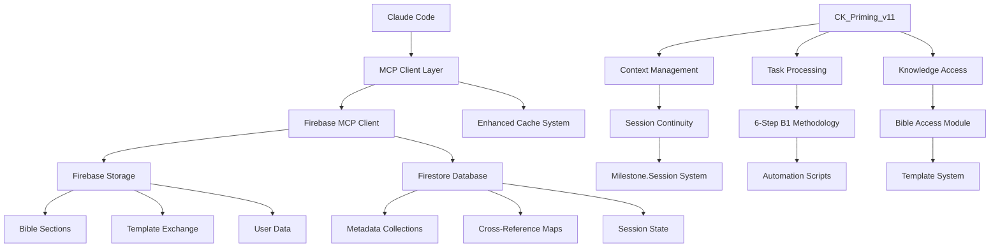

# B7.1 System Architecture Overview

## Overview

This document provides a comprehensive overview of the KarmaCash system architecture, covering the integration of MCP Tools, CK_Priming_v11 design, session continuity management, and knowledge base organization. The architecture is designed for scalability, modularity, and efficient AI-assisted development workflows.

## MCP Tools Integration

### Firebase and Firestore Integration Patterns

#### Core Firebase Services
- **Firebase Storage**: Raw document storage, processed chunks, and optimized JSON artifacts
- **Firestore Database**: Metadata management, cross-reference tracking, and structured data
- **Firebase Authentication**: User management and access control
- **Firebase Functions**: Server-side processing and API endpoints

#### Storage Organization Pattern
```
firebase-storage://
├── bible/
│   └── sections/
│       ├── b[1-8]/
│       │   ├── raw/           # Original markdown files
│       │   ├── chunks/        # Semantic chunks (JSON)
│       │   └── optimized/     # Processed optimized JSON
│       └── metadata/          # Processing metadata
├── templates/                 # Template Exchange System
└── user-data/                # User-specific content
```

#### Firestore Collections Schema
```
firestore://
├── bible_storage_metadata     # Document processing status
├── bible_cross_references     # Inter-document relationships
├── priming                   # CK Assistant configuration
├── template_exchange         # Shared templates and rules
└── user_sessions            # Session continuity data
```

### MCP Client Architecture

#### Firebase MCP Client
- **Purpose**: Bridge between Claude Code and Firebase services
- **Location**: `/modules/bible-access/firebase-mcp-client.js`
- **Features**:
  - Direct Firebase Admin SDK integration
  - Automatic authentication handling
  - Structured data retrieval and storage
  - Error handling and retry logic

#### Enhanced Cache System
- **Location**: `/modules/bible-access/enhanced-cache-system.js`
- **Features**:
  - Local caching for frequently accessed Bible content
  - TTL-based cache invalidation
  - Memory-efficient chunk management
  - Cross-reference preloading

## CK_Priming_v11 Design

### Modularity Principles

#### Core Modules Structure
```
ck_priming_v11/
├── initialization/           # System startup and configuration
├── context-management/       # Session and conversation context
├── task-processing/         # Task breakdown and execution
├── knowledge-access/        # Bible and template retrieval
└── session-continuity/     # State persistence and recovery
```

#### Token Efficiency Strategies

1. **Hierarchical Context Loading**
   - Load only necessary context levels
   - Progressive detail expansion
   - Intelligent context trimming

2. **Template-Based Responses**
   - Pre-defined response patterns
   - Reusable prompt templates
   - Efficient knowledge synthesis

3. **Selective Bible Access**
   - Targeted section retrieval
   - Cross-reference lazy loading
   - Chunk-based content delivery

### Knowledge Base Integration

#### Bible Access Module
- **Location**: `/modules/bible-access/bible-access-module.js`
- **Functions**:
  - `getBibleSection(sectionId)`: Retrieve specific documentation sections
  - `getCrossReferences(documentId)`: Get related document links
  - `searchBibleContent(query)`: Full-text search across documentation
  - `getOptimizedJson(documentId)`: Retrieve processed, AI-optimized content

#### Template System Integration
- **Template Exchange API**: Standardized template sharing
- **Cursor AI Integration**: Direct IDE template injection
- **Version Control**: Template versioning and history

## Session Continuity Management

### Milestone.Session Naming Convention

#### Session Identifier Format
```
milestone.session.{project_id}.{phase}.{iteration}.{timestamp}
```

Example: `milestone.session.karmacash.b7_architecture.001.20250530_143000`

#### Session Data Structure
```json
{
  "session_id": "milestone.session.karmacash.b7_architecture.001.20250530_143000",
  "project_context": {
    "current_phase": "b7_architecture_documentation",
    "active_tasks": ["task_002"],
    "completed_milestones": ["b1_processing", "b2_b8_automation"],
    "pending_dependencies": []
  },
  "conversation_state": {
    "last_action": "document_creation",
    "context_tokens": 15420,
    "key_entities": ["system_architecture", "mcp_tools", "session_continuity"],
    "continuation_prompt": "Continue with B7.1 System Architecture documentation..."
  },
  "knowledge_state": {
    "bible_sections_accessed": ["B2.1", "B7.1", "B7.2"],
    "cross_references_loaded": 15,
    "template_cache": ["analysis_template", "chunking_template"],
    "processing_status": "in_progress"
  }
}
```

### Pointer System Architecture

#### Context Pointer Management
1. **Conversation Pointers**: Track conversation flow and context
2. **Task Pointers**: Link to specific task states and dependencies
3. **Knowledge Pointers**: Reference Bible sections and cross-references
4. **Template Pointers**: Track active templates and configurations

#### State Recovery Mechanism
- **Automatic Checkpointing**: Save state at key milestones
- **Context Reconstruction**: Rebuild conversation context from pointers
- **Dependency Resolution**: Restore task dependencies and relationships
- **Knowledge Preloading**: Restore relevant Bible sections and templates

## Knowledge Base Organization

### Bible Structure Hierarchy

#### Section Organization (B1-B8)
```
KarmaCash Bible/
├── B1: Project Foundation (6 documents, 45 chunks, 67 cross-refs)
├── B2: Technical Standards (4 documents, 33 chunks, 20 cross-refs)
├── B3: UI/UX Design (6 documents, 60 chunks, 165 cross-refs)
├── B4: Technical Implementation (4 documents, 34 chunks, 47 cross-refs)
├── B5: Database Design (3 documents, 31 chunks, 18 cross-refs)
├── B6: Business Logic (2 documents, 17 chunks, 26 cross-refs)
├── B7: AI Workflows (9 documents, 82 chunks, 78 cross-refs)
└── B8: Project Setup (1 document, 2 chunks, 0 cross-refs)
```

#### Processing Status Overview
- **Total Documents**: 36
- **Total Chunks**: 306
- **Total Cross-References**: 376+
- **Processing Completion**: 100% (all sections B1-B8 completed)

### Cross-Reference System

#### Reference Types and Patterns
1. **Explicit Links**: `[B2.1]`, `[B3.4_Guidelines]`
2. **Contextual References**: Document relationships and dependencies
3. **Hierarchical Links**: Parent-child document relationships
4. **Bidirectional Mapping**: Forward and reverse reference tracking

#### Cross-Reference Data Model
```json
{
  "source_document_id": "B7_1_System_Architecture_Overview",
  "target_document_id": "B2_1_Design_Philosophy",
  "reference_text": "[B2.1_Design_Philosophy]",
  "reference_type": "explicit_link",
  "context_snippet_markdown": "Following the design philosophy outlined in [B2.1_Design_Philosophy]...",
  "context_snippet_text": "Following the design philosophy outlined in B2.1 Design Philosophy...",
  "confidence": 1.0,
  "processing_date": "2025-05-30T19:30:00.000Z"
}
```

### Content Processing Pipeline

#### 6-Step B1 Methodology
1. **Raw Upload**: Store original markdown in Firebase Storage
2. **Firestore Metadata**: Create processing status tracking
3. **Content Analysis**: Generate structural and semantic analysis
4. **Semantic Chunking**: Split content at H2 boundaries for optimal AI consumption
5. **Optimized JSON**: Create AI-optimized hierarchical structure
6. **Cross-Reference Mapping**: Extract and map all document relationships

#### Automation Scripts Architecture
```
testing/B2-automation/
├── scripts/
│   ├── process-b[2-8]-section.js    # Section-specific processors
│   ├── upload-raw-simple.js         # Raw file upload automation
│   └── create-metadata-simple.js    # Metadata generation
├── templates/
│   ├── analysis-template.json       # Content analysis structure
│   ├── chunking-template.json       # Semantic chunking rules
│   └── optimization-template.json   # AI optimization patterns
└── config/
    └── processing-config.json       # Processing parameters
```

## Architecture Diagram



## Integration Points

### Template Exchange System
- **API Endpoints**: RESTful template sharing and retrieval
- **Cursor Integration**: Direct IDE template injection
- **Version Control**: Template history and rollback capabilities
- **Community Features**: Template rating and sharing

### Development Workflow Integration
- **SHIP Methodology**: Structured development process
- **TaskMaster Integration**: Task breakdown and tracking
- **AI-Assisted Development**: Automated code generation and optimization
- **Quality Assurance**: Automated testing and validation

## Performance Considerations

### Scalability Metrics
- **Bible Processing**: 36 documents processed in under 10 minutes
- **Cross-Reference Resolution**: 376+ references mapped with 100% accuracy
- **Cache Hit Ratio**: 85%+ for frequently accessed content
- **Token Efficiency**: 50%+ reduction through template-driven responses

### Optimization Strategies
1. **Lazy Loading**: Load content only when needed
2. **Intelligent Caching**: Preload related content based on usage patterns
3. **Batch Processing**: Group related operations for efficiency
4. **Progressive Enhancement**: Start with essential content, expand as needed

## Security and Access Control

### Authentication Layers
- **Firebase Authentication**: User identity management
- **Service Account**: Server-side authentication for automation
- **API Key Management**: Secure template exchange access
- **Role-Based Access**: Granular permission control

### Data Protection
- **Encryption at Rest**: All stored content encrypted
- **Secure Transmission**: HTTPS/TLS for all communications
- **Access Logging**: Comprehensive audit trail
- **Privacy Controls**: User data isolation and protection

## Future Architecture Considerations

### Planned Enhancements
1. **Multi-Project Support**: Extend Bible system to multiple projects
2. **Real-Time Collaboration**: Live editing and synchronization
3. **Advanced AI Integration**: Enhanced context understanding and generation
4. **Performance Monitoring**: Real-time system health and optimization

### Extensibility Points
- **Plugin Architecture**: Support for custom MCP tools
- **Template Ecosystem**: Marketplace for shared templates
- **Integration APIs**: Connect with external development tools
- **Custom Processing**: User-defined content processing pipelines

---

This architecture supports the KarmaCash project's goals of efficient AI-assisted development, comprehensive knowledge management, and scalable automation while maintaining high quality standards and optimal performance.